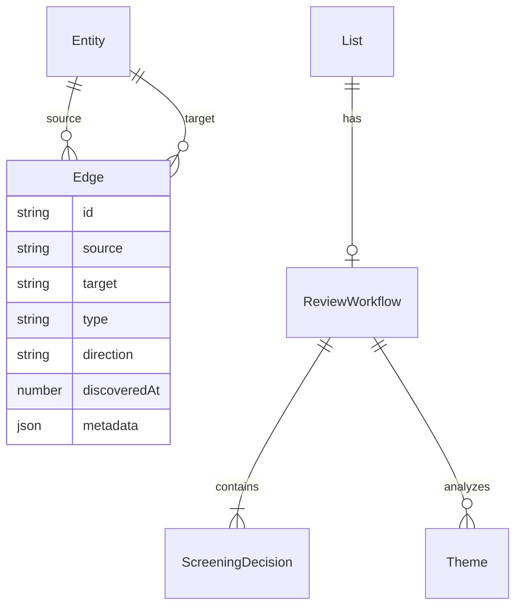

# Data Model: Advanced Literature Review Workflows

**Feature**: 029-literature-review
**Date**: 2025-11-30
**Updated**: 2025-12-02 (Terminology refinement, Graph Index alignment)
**Related**: [034-persistent-graph-index](../034-persistent-graph-index/data-model.md) - Graph storage for entity relationships

---

## Terminology Model

### Hierarchy

**Lists** is the umbrella term for the feature. All groupings of entities are types of lists.

```
LISTS (feature/umbrella term)
│
├── Collections (user-created, origin: "created")
│   ├── [Generic] - constraint: "any", can contain any entities including lists
│   └── Bibliography - constraint: "works-only", works only
│       └── Can become a Review when workflow is attached
│
├── Built-in (origin: "built-in")
│   ├── Bookmarks - quick-save, any entities
│   └── History - auto-tracked visits
│
├── Samples (origin: "sample", static/bundled)
│   ├── Sample Bibliographies
│   └── Sample Reviews
│
└── Indexes (origin: "index", computed, read-only)
    ├── Memory Cache Index
    ├── Local Cache Index
    └── Static Cache Index
```

### Term Definitions

| Term | Definition | Origin |
|------|------------|--------|
| **List** | Umbrella term for the feature and any grouping of entities | N/A |
| **Collection** | User-created list of entities | `created` |
| **Bibliography** | Collection constrained to works only | `created` |
| **Review** | Bibliography with active PRISMA workflow attached | `created` |
| **Bookmarks** | Built-in quick-save list | `built-in` |
| **History** | Built-in visit tracking list | `built-in` |
| **Sample** | Pre-packaged example list | `sample` |
| **Index** | Computed view of cached entities | `index` |

### Key Insight: Review is a State, Not a Type

A Review is NOT a separate entity type. It is a Bibliography with a PRISMA workflow attached:

```
Bibliography ──[start review]──► Bibliography + ReviewWorkflow
                                 (still a Bibliography, now with PRISMA)
```

### Differentiating Properties

| Property | Values | Purpose |
|----------|--------|---------|
| **origin** | `created` \| `built-in` \| `sample` \| `index` | How it came to exist |
| **constraint** | `any` \| `works-only` | What entities allowed |
| **workflow** | `ReviewWorkflow \| null` | Has PRISMA workflow |
| **mutability** | `full` \| `entries` \| `readonly` | What can be changed |
| **storage** | `local` \| `static` \| `computed` | Where data lives |
| **shareable** | `boolean` | Can be URL-encoded and shared |

### Property Matrix

| List Type | origin | constraint | workflow | mutability | storage | shareable |
|-----------|--------|------------|----------|------------|---------|-----------|
| Collection | created | any | none | full | local | ✓ |
| Bibliography | created | works-only | none | full | local | ✓ |
| Review | created | works-only | review | full | local | ✓ |
| Bookmarks | built-in | any | none | entries | local | ✓ |
| History | built-in | any | none | entries | local | ✗ |
| Sample Bib | sample | works-only | none | readonly | static | ✓ |
| Sample Review | sample | works-only | review | readonly | static | ✓ |
| Cache Index | index | any | none | readonly | computed | ✗ |

### Nesting Rules (via Edges)

Lists can contain other lists. The `constraint` property determines what a list can contain:

| Constraint | Can contain lists? | Can contain works? | Can contain other entities? |
|------------|-------------------|--------------------|-----------------------------|
| `any` | ✓ Yes | ✓ Yes | ✓ Yes |
| `works-only` | ✗ No | ✓ Yes | ✗ No |

### Structure: Forest with Virtual Grouping

Lists use a **forest model** (multiple roots) with **virtual grouping by origin**:

- Lists with no `belongs_to` edge are top-level within their origin group
- UI groups lists by `origin` property for display
- No artificial root entity required

---

## Entity Relationships

All relationships are **edges** between entities. Lists are first-class entities, so list relationships follow the same pattern as any other entity relationship.

**Integration with Graph Index**: List edges are stored in the persistent graph index (see [spec 034](../034-persistent-graph-index/data-model.md)) alongside OpenAlex entity relationships. This enables unified graph queries across both discovered OpenAlex relationships and user-created list memberships.



### Edge Model

The edge model aligns with `GraphEdgeRecord` from spec 034 to enable unified graph queries.

```typescript
import type { RelationType, EdgeDirection } from '@bibgraph/types';

/**
 * All relationships between entities are edges.
 * This aligns with GraphEdgeRecord from spec 034 (persistent-graph-index).
 *
 * List-specific relationship types are added to the RelationType union.
 */
interface Edge {
  /**
   * Unique edge identifier.
   * Format: `${source}-${target}-${type}` (e.g., "L123-W456-CONTAINS")
   */
  id: string;

  /** Source entity ID (OpenAlex ID or List ID) */
  source: string;

  /** Target entity ID (OpenAlex ID or List ID) */
  target: string;

  /** Relationship type (extends RelationType from spec 034) */
  type: RelationType | ListRelationType;

  /**
   * Direction indicator based on data ownership.
   * - 'outbound': Source entity contains the relationship data
   * - 'inbound': Target entity contains the relationship data
   */
  direction: EdgeDirection;

  /** Unix timestamp (ms) when edge was discovered/created */
  discoveredAt: number;

  /** Optional edge metadata (for list-specific properties) */
  metadata?: Record<string, unknown>;
}

/**
 * List-specific relationship types (extends RelationType from spec 034)
 */
type ListRelationType =
  | "CONTAINS"      // List contains entity (including nested lists)
  | "BELONGS_TO"    // List is associated with parent entity

/**
 * Extended RelationType union including list relationships
 */
type ExtendedRelationType = RelationType | ListRelationType;
```

### Edge Examples

| Source | Type | Target | Direction | Meaning |
|--------|------|--------|-----------|---------|
| L1 | `CONTAINS` | W1 | outbound | List L1 contains work W1 |
| L1 | `CONTAINS` | W2 | outbound | List L1 contains work W2 |
| L1 | `CONTAINS` | L2 | outbound | List L1 contains list L2 (nesting) |
| L1 | `BELONGS_TO` | A123 | outbound | List L1 is associated with author A123 |
| L1 | `BELONGS_TO` | W789 | outbound | List L1 is bibliography of work W789 |
| W1 | `REFERENCE` | W2 | outbound | Work W1 cites work W2 (from spec 034) |
| W1 | `AUTHORSHIP` | A1 | outbound | Work W1 has author A1 (from spec 034) |

### Edge Metadata

Edges can carry metadata for additional context. List edges use the same `metadata` field as OpenAlex edges (spec 034), enabling unified graph queries.

```typescript
// List entry with PRISMA screening status
const containsEdge: Edge = {
  id: "L1-W1-CONTAINS",
  source: "L1",
  target: "W1",
  type: "CONTAINS",
  direction: "outbound",
  discoveredAt: 1701500000000,
  metadata: {
    prismaStage: "included",
    notes: "Key methodology paper"
  }
};

// List association with label
const belongsToEdge: Edge = {
  id: "L1-W789-BELONGS_TO",
  source: "L1",
  target: "W789",
  type: "BELONGS_TO",
  direction: "outbound",
  discoveredAt: 1701500000000,
  metadata: {
    label: "bibliography"  // Human-readable relationship label
  }
};
```

### Graph Index Integration

List edges are stored in the persistent graph index (spec 034) alongside OpenAlex entity relationships. This provides:

1. **Unified Queries**: Query all relationships (OpenAlex + lists) through single graph API
2. **Traversal**: Navigate from works to containing lists and vice versa
3. **Persistence**: List memberships survive page refreshes
4. **Performance**: In-memory graph enables fast neighbor lookups

```typescript
// Query: Find all lists containing a specific work
const containingLists = await graphIndex.edges
  .where('target').equals('W2741809807')
  .and(edge => edge.type === 'CONTAINS')
  .toArray();

// Query: Find all works in a list with PRISMA stage = "included"
const includedWorks = await graphIndex.edges
  .where('source').equals('L123')
  .and(edge =>
    edge.type === 'CONTAINS' &&
    edge.metadata?.prismaStage === 'included'
  )
  .toArray();
```

---

## Core Entities

### List (First-Class Entity)

Lists are first-class entities with type `"lists"` and ID prefix `L`. All containment and association relationships are expressed as edges.

```typescript
// Lists as a first-class entity type
type EntityType =
  | "works" | "authors" | "institutions" | "sources"
  | "publishers" | "funders" | "topics" | "concepts"
  | "keywords" | "domains" | "fields" | "subfields"
  | "lists"  // First-class entity type

interface List {
  // ID: pako-compressed base64url payload with "L" prefix for shareable lists
  // Or: "L" + UUID for locally-stored lists
  id: string
  type: "lists"

  // Core metadata
  title: string
  description?: string

  // Classification (differentiating properties)
  origin: "created" | "built-in" | "sample" | "index"
  constraint: "any" | "works-only"
  workflow: ReviewWorkflow | null

  // Capabilities (derived from origin)
  mutability: "full" | "entries" | "readonly"
  storage: "local" | "static" | "computed"
  shareable: boolean

  // Timestamps
  createdAt: number   // Unix epoch ms
  updatedAt: number   // Unix epoch ms

  // Note: No parentEntity or entries fields
  // All relationships expressed as edges (stored in graph index per spec 034):
  //   - Contents: edges where source=this.id, type="CONTAINS"
  //   - Parent: edges where source=this.id, type="BELONGS_TO"
}

/**
 * Payload encoded in the list ID using pako compression
 * Designed for URL-safe sharing while keeping URLs reasonably short
 *
 * This is a SERIALIZATION FORMAT for the edge-based model.
 * When decoded, edges are expanded into the graph index (spec 034).
 * Short keys are used for compression efficiency.
 */
interface EncodedListPayload {
  // UUID for uniqueness (even if contents are identical)
  uuid: string  // e.g., "550e8400-e29b-41d4-a716-446655440000"

  // Core metadata (kept minimal for compression)
  t: string                    // title
  d?: string                   // description (optional)

  // Classification
  o: "c" | "b" | "s" | "i"     // origin: created, built-in, sample, index
  cn: "a" | "w"                // constraint: any, works-only

  // ─────────────────────────────────────────────────────────────────────
  // EDGES (serialized)
  // Edges are the canonical model; these are compact serializations
  // ─────────────────────────────────────────────────────────────────────

  // "belongs_to" edge (optional) - associates list with parent entity
  // Serialized: { target, relationship: "belongs_to", metadata: { label } }
  bt?: {
    id: string                 // target entity ID
    l?: string                 // label (e.g., "bibliography", "collaborators")
  }

  // "contains" edges - entity IDs this list contains
  // Serialized: { source: this.id, target: entityId, relationship: "contains" }
  // Entity types inferred from ID prefix (W=works, A=authors, L=lists, etc.)
  e: string[]

  // Edge metadata for "contains" edges, keyed by entity ID
  // e.g., { "W123": { prismaStage: "included", addedAt: 1701500000000 } }
  em?: Record<string, Record<string, unknown>>

  // Timestamps (Unix epoch for compression)
  ca: number  // createdAt
  ua: number  // updatedAt

  // ═══════════════════════════════════════════════════════════════════════════
  // RECONCILIATION SUPPORT
  // Three approaches implemented for UX experimentation:
  // 1. Same-UUID detection + diff UI (uses uuid field above)
  // 2. Base reference chain (baseUuid field)
  // 3. CRDT operations (ops array)
  // ═══════════════════════════════════════════════════════════════════════════

  // [Approach 2] Base reference chain for 3-way merge
  // Points to the UUID of the list this was derived from
  // Enables git-style 3-way merge: find common ancestor, compute diffs
  bu?: string  // baseUuid - UUID of parent version

  // [Approach 3] CRDT operation log for automatic merge
  // OR-Set (Observed-Remove Set) semantics: entity is present if max(add) > max(remove)
  // Operations are commutative, idempotent, and associative
  ops?: ListOperation[]
}

/**
 * CRDT operation for list membership changes
 * Uses Lamport timestamps for ordering across distributed edits
 */
interface ListOperation {
  // Operation type
  op: "add" | "remove" | "meta"  // add entity, remove entity, update metadata

  // Target entity
  eid: string  // entity ID (e.g., "W2741809807")

  // Lamport timestamp: [unix_ms, node_id_hash]
  // Ensures total ordering even with clock skew
  ts: [number, string]  // e.g., [1718409600000, "a3f2"]

  // For "meta" operations: the metadata being set
  md?: Record<string, unknown>
}

/**
 * ═══════════════════════════════════════════════════════════════════════════
 * RECONCILIATION APPROACHES - Detailed Documentation
 * ═══════════════════════════════════════════════════════════════════════════
 *
 * SCENARIO: User A shares list with User B. Both make independent changes.
 *           A shares updated URL to B, B shares theirs to A.
 *
 * ───────────────────────────────────────────────────────────────────────────
 * APPROACH 1: Same-UUID Detection + Diff UI
 * ───────────────────────────────────────────────────────────────────────────
 *
 * How it works:
 * - When user opens a list URL, check if local storage has a list with same UUID
 * - If found and contents differ, show diff UI for manual merge
 *
 * Detection:
 *   incoming.uuid === stored.uuid && incoming.ua !== stored.ua
 *
 * UI Flow:
 *   "You have a different version of this list. Compare changes?"
 *   → Side-by-side diff showing added/removed/modified entities
 *   → User manually selects which changes to keep
 *   → Creates new list with merged state (new UUID or preserve original)
 *
 * Pros: Simple, user has full control, no extra payload size
 * Cons: Manual effort, doesn't scale for frequent collaboration
 *
 * ───────────────────────────────────────────────────────────────────────────
 * APPROACH 2: Base Reference Chain (3-Way Merge)
 * ───────────────────────────────────────────────────────────────────────────
 *
 * How it works:
 * - Each derived list stores `bu` (baseUuid) pointing to its parent version
 * - When merging, find common ancestor and compute 3-way diff
 * - Similar to git merge: base → A changes, base → B changes
 *
 * Chain structure:
 *   Original (uuid: "aaa", bu: null)
 *       ├── A's edit (uuid: "bbb", bu: "aaa")
 *       └── B's edit (uuid: "ccc", bu: "aaa")
 *
 * Merge algorithm:
 *   1. Find common ancestor (bu chain intersection)
 *   2. Compute diff: ancestor → version A
 *   3. Compute diff: ancestor → version B
 *   4. Apply non-conflicting changes automatically
 *   5. Present conflicts for manual resolution
 *
 * Pros: Smarter auto-merge, familiar git-like model
 * Cons: Requires storing/fetching ancestor versions, chain can get long
 *
 * ───────────────────────────────────────────────────────────────────────────
 * APPROACH 3: CRDT Operations (Automatic Merge)
 * ───────────────────────────────────────────────────────────────────────────
 *
 * How it works:
 * - Instead of storing final state, store operations that produced it
 * - OR-Set semantics: entity present if latest op is "add"
 * - Operations from any source can be merged without conflicts
 *
 * OR-Set membership rule:
 *   isPresent(entityId) = max(addTimestamps) > max(removeTimestamps)
 *
 * Example merge:
 *   A's ops: [{ op: "add", eid: "W1", ts: [1000, "a"] }]
 *   B's ops: [{ op: "add", eid: "W2", ts: [1001, "b"] },
 *             { op: "remove", eid: "W3", ts: [1002, "b"] }]
 *
 *   Merged: All ops combined → W1 present, W2 present, W3 removed
 *
 * Compaction:
 * - Periodically compact ops: keep only latest op per entity
 * - Reset ops array when sharing (include current state in `e` array)
 *
 * Pros: True conflict-free merge, works offline, scales to many collaborators
 * Cons: Larger payload, more complex implementation, semantic conflicts possible
 *       (e.g., both users add same entity with different metadata)
 *
 * ───────────────────────────────────────────────────────────────────────────
 * IMPLEMENTATION STRATEGY
 * ───────────────────────────────────────────────────────────────────────────
 *
 * All three approaches coexist:
 * - Approach 1 always active (uuid comparison is trivial)
 * - Approach 2 enabled when `bu` field present
 * - Approach 3 enabled when `ops` array present
 *
 * User can choose reconciliation strategy in settings:
 * - "Manual diff" (Approach 1)
 * - "Smart merge" (Approach 2)
 * - "Auto merge" (Approach 3)
 *
 * Fallback chain: If CRDT fails → try 3-way → fall back to manual diff
 */

/**
 * ID Encoding/Decoding utilities
 *
 * Encode: List → pako.deflate → base64url → "L" prefix
 * Decode: Remove "L" → base64url decode → pako.inflate → List
 *
 * Example encoded ID (hypothetical):
 * "LeJyrVspLz0nNBQA" (very short lists)
 * "LeNqtk81qwzAQhF9F6By7cuw4..." (typical bibliography)
 *
 * URL length considerations:
 * - Safe limit: ~2000 characters
 * - Typical work ID: 10-12 chars (e.g., "W2741809807")
 * - With pako compression: ~100-150 entities fit in safe URL length
 * - For larger lists: Use stored reference ID with lazy loading
 */
```

**Use Cases (belongs_to edges):**

| belongs_to Target | List Type | Contains | Example |
|-------------------|-----------|----------|---------|
| Work (review paper) | bibliography | Works | Papers cited by a systematic review |
| Work (draft) | bibliography | Works | User's paper being written |
| Author | collection | Authors | Co-author network |
| Author | collection | Works | Curated publication list |
| Institution | collection | Works | Research outputs |
| Institution | collection | Authors | Faculty/researchers |
| Source (journal) | collection | Works | Issue table of contents |
| Topic | bibliography | Works | Seminal papers in field |
| Funder | collection | Works | Grant-funded research |
| List | collection | Lists | Nested list (list of lists) |
| (none) | collection | Mixed | User's general collection |

**Nesting Example:**

```
List: "My Systematic Reviews" (Collection)
  ├── id: "LeNqtk81qwzAQhF9F..." (pako-encoded payload)
  ├── decoded payload: {
  │     uuid: "550e8400-e29b-41d4-a716-446655440000",
  │     t: "My Systematic Reviews",
  │     o: "c", cn: "a",  // origin: created, constraint: any
  │     bt: { id: "A5017898742", l: "research" },  // belongs_to author
  │     e: ["LeJyrVspLz0nNBQA...", "LeKx2jVspMz1nOCR..."],  // nested lists
  │     ca: 1719792000, ua: 1719792000
  │   }
  └── contains edges to nested list IDs

List: "Review 1 Bibliography" (Bibliography with Review workflow)
  ├── id: "LeJyrVspLz0nNBQA..." (pako-encoded payload)
  ├── decoded payload: {
  │     uuid: "660f9500-f3ac-52e5-b827-557766551111",
  │     t: "Review 1 Bibliography",
  │     o: "c", cn: "w",  // origin: created, constraint: works-only
  │     bt: { id: "W3187234764", l: "bibliography" },  // belongs_to work
  │     e: ["W2741809807", "W2760813866", "W2893746512"],  // contains works
  │     em: {
  │       "W2741809807": { prismaStage: "included" },
  │       "W2760813866": { prismaStage: "included" },
  │       "W2893746512": { prismaStage: "excluded" }
  │     },
  │     ca: 1719792000, ua: 1719792000
  │   }
  └── entities hydrated from OpenAlex using IDs in payload
```

**Sample Bibliographies:**

Sample bibliographies are Lists with `origin: "sample"` where:
- The pako-encoded ID contains the full list state
- `belongs_to` edge references an existing OpenAlex review paper
- `constraint` is "works-only" (bibliography)
- Edge metadata includes PRISMA stage assignments
- Lists are shareable via URL: `/lists/LeNqtk81qwzAQhF9F...`

```typescript
// Sample bibliography payload (before pako encoding)
const samplePayload: EncodedListPayload = {
  uuid: "cochrane-ml-2024-550e8400",  // Can use semantic UUID for samples
  t: "ML in Medical Diagnosis - Cochrane Review",
  d: "Bibliography from Cochrane systematic review on ML diagnostics",
  o: "s",   // origin: sample
  cn: "w",  // constraint: works-only
  bt: {
    id: "W3187234764",    // belongs_to: the published review paper
    l: "bibliography"     // relationship label
  },
  e: ["W2741809807", "W2760813866", "W2893746512"],  // contains edges
  em: {
    "W2741809807": { prismaStage: "included", qualityScore: 8 },
    "W2760813866": { prismaStage: "included", qualityScore: 7 },
    "W2893746512": { prismaStage: "excluded", reason: "wrong population" }
  },
  ca: 1718409600,  // 2024-06-15 as Unix timestamp
  ua: 1718409600
}

// Encoded ID: "L" + base64url(pako.deflate(JSON.stringify(samplePayload)))
// Result: "LeNqtk81qwzAQhF9F6By7cuw4sRMnJNBDpUqlXnLoIbfKWq..."

// Hydrated List (after decoding payload + fetching OpenAlex data)
const sampleBibliography: List = {
  id: "LeNqtk81qwzAQhF9F6By7cuw4sRMnJNBDpUqlXnLoIbfKWq...",
  type: "lists",
  title: "ML in Medical Diagnosis - Cochrane Review",
  description: "Bibliography from Cochrane systematic review on ML diagnostics",
  origin: "sample",
  constraint: "works-only",
  workflow: null,  // Could have ReviewWorkflow attached
  mutability: "readonly",
  storage: "static",
  shareable: true,
  createdAt: 1718409600000,
  updatedAt: 1718409600000
}

// Associated edges (stored in graph index per spec 034)
const edges: Edge[] = [
  { id: `${sampleBibliography.id}-W3187234764-BELONGS_TO`, source: sampleBibliography.id, target: "W3187234764", type: "BELONGS_TO", direction: "outbound", discoveredAt: 1718409600000, metadata: { label: "bibliography" } },
  { id: `${sampleBibliography.id}-W2741809807-CONTAINS`, source: sampleBibliography.id, target: "W2741809807", type: "CONTAINS", direction: "outbound", discoveredAt: 1718409600000, metadata: { prismaStage: "included", qualityScore: 8 } },
  { id: `${sampleBibliography.id}-W2760813866-CONTAINS`, source: sampleBibliography.id, target: "W2760813866", type: "CONTAINS", direction: "outbound", discoveredAt: 1718409600000, metadata: { prismaStage: "included", qualityScore: 7 } },
  { id: `${sampleBibliography.id}-W2893746512-CONTAINS`, source: sampleBibliography.id, target: "W2893746512", type: "CONTAINS", direction: "outbound", discoveredAt: 1718409600000, metadata: { prismaStage: "excluded", reason: "wrong population" } },
]
```

### ReviewWorkflow

Represents a PRISMA 2020 compliant workflow attached to a Bibliography. A Bibliography becomes a "Review" when it has a ReviewWorkflow attached.

```typescript
/**
 * ReviewWorkflow is attached to a Bibliography (List with constraint: "works-only")
 * to enable systematic review functionality.
 *
 * A Bibliography with workflow !== null is considered a "Review"
 */
interface ReviewWorkflow {
  id: string

  // Review methodology type
  reviewType: "systematic" | "narrative" | "scoping" | "meta-analysis" | "rapid"
  researchDomain?: string
  methodology?: string

  // Workflow State
  status: "planning" | "searching" | "screening" | "analyzing" | "writing" | "complete"
  progress: {
    total: number
    included: number
    excluded: number
    pending: number
  }

  // PRISMA Tracking
  prismaFlowData: {
    identified: number
    screened: number
    eligible: number
    included: number
  }

  // Semantic Analysis Integration
  semanticAnalysisEnabled: boolean
  topicModelingStages: ("identification" | "screening" | "eligibility" | "inclusion")[]
  semanticClusters: Array<{
    stage: string
    clusters: Array<{
      id: string
      label: string
      keywords: string[]
      paperCount: number
      avgRelevanceScore: number
    }>
  }>

  // Metadata
  createdAt: number   // Unix epoch ms
  updatedAt: number
}
```

### ScreeningDecision

Records inclusion/exclusion decisions with structured criteria and audit trail.

```typescript
interface ScreeningDecision {
  id: string
  reviewWorkflowId: string  // ID of the ReviewWorkflow this decision belongs to
  entityId: string

  // Decision
  included: boolean
  decisionType: "pending" | "included" | "excluded" | "maybe"

  // Criteria
  criteria: string[]
  reason?: string

  // Reviewer Information
  reviewer?: string
  timestamp: Date

  // Quality Assessment
  qualityScore?: number // 1-10 methodological quality
  biasRisk?: "low" | "medium" | "high"
  sampleSize?: number
  effectSize?: number

  // Metadata
  notes?: string
  confidence?: number // 0-100 confidence in decision
}
```

### Theme

Represents thematic analysis results with manual editing capabilities.

```typescript
interface Theme {
  id: string
  reviewWorkflowId?: string  // Associated ReviewWorkflow (if part of a review)
  label: string
  description?: string
  color: string // Hex color for visualization

  // Topic Analysis
  keywords: string[]
  relevanceScore?: number // 1-5 relevance rating
  centroid?: number[] // For spatial visualization

  // Management
  isLocked: boolean
  parentThemeId?: string
  childThemeIds: string[]

  // Associated Studies
  paperIds: string[]
  paperCount: number

  // Metadata
  createdAt: Date
  updatedAt: Date
  createdBy?: string
}
```

### CustomEntity

Extends standard entities for non-OpenAlex works with file system integration. Custom entities are locally-created entities that don't exist in OpenAlex.

```typescript
interface CustomEntity {
  // Standard entity fields
  id: string              // "X" prefix for custom entities (e.g., "X550e8400-e29b...")
  type: EntityType        // Usually "works" for custom papers
  display_name: string
  // Custom Entity Identification
  isCustomEntity: true
  localEntityId: string // For entities not in OpenAlex

  // Metadata Source
  sourceType: "manual" | "file_import" | "doi_lookup" | "user_input" | "local_file_sync"
  verificationStatus: "verified" | "unverified" | "pending"
  lastValidated?: Date
  originalData?: any // Raw data from import

  // File System Integration
  fileInfo?: {
    localPath?: string // Relative path in synced folder
    fileName?: string
    fileSize?: number
    fileType?: string
    lastModified?: Date
    syncStatus: "synced" | "pending" | "conflict" | "error"
    extractedMetadata?: {
      title?: string
      authors?: string[]
      abstract?: string
      publicationYear?: number
      doi?: string
      pages?: string
    }
  }
}
```

### SyncConfiguration

Manages file system synchronization settings and conflict resolution preferences.

```typescript
interface SyncConfiguration {
  id: string
  userId?: string

  // Folder Configuration
  localFolderPath?: string
  syncDirection: "bidirectional" | "import-only" | "export-only"

  // Sync Settings
  autoSync: boolean
  syncIntervalMinutes: number
  fileTypes: string[] // ["pdf", "docx", "epub", "txt"]

  // Conflict Resolution
  conflictStrategy: "local-wins" | "remote-wins" | "manual" | "merge"
  conflictResolutionHistory: Array<{
    fileId: string
    timestamp: Date
    resolution: string
    chosenStrategy: string
  }>

  // Status
  isActive: boolean
  lastSyncAt?: Date
  syncStatus: "idle" | "syncing" | "error" | "conflicts-detected"

  // Performance
  batchSize: number
  maxFileSize: number // bytes
  rateLimitMs?: number

  // Metadata
  createdAt: Date
  updatedAt: Date
}
```

### Sample Lists (Static Files)

Sample lists are pre-packaged `List` entities served via the public folder. They use the same data structure as user-created lists, just stored as static JSON for demonstration and onboarding purposes.

**File System Structure:**
```
apps/web/public/data/lists/
├── index.json                           # Master index of all sample lists
├── L-cochrane-ml-2024/
│   ├── list.json                        # List entity data
│   └── review-workflow.json             # Optional: ReviewWorkflow data
├── L-climate-adaptation-2023/
│   ├── list.json
│   └── review-workflow.json
└── ...
```

**Master Index Structure:**
```typescript
interface SampleListIndex {
  lastUpdated: string // ISO date
  lists: Array<{
    id: string                    // List ID (e.g., "L-cochrane-ml-2024")
    title: string
    belongsTo?: string            // Parent entity ID (e.g., review paper Work ID)
    constraint: "any" | "works-only"
    entityCount: number
    hasWorkflow: boolean          // Whether ReviewWorkflow is attached
    tags: string[]
    $ref: string                  // Relative path to list folder
  }>
}
```

**Data Loading Strategy:**
1. Load sample list index from static JSON
2. Load specific `List` entity data on demand
3. Fetch parent entity from OpenAlex (cache → API fallback) if `belongsTo` specified
4. Fetch contained entities from OpenAlex as needed
5. All entities navigable via existing routes (`/works/W123`, `/lists/L123`)

### CitationExportConfiguration

Configuration for citation export formats and custom fields.

```typescript
interface CitationExportConfiguration {
  format: "bibtex" | "ris" | "csv"

  // BibTeX Options
  bibtexOptions?: {
    includeCustomFields: boolean
    customFieldPrefix?: string
    entryTypeMapping: Record<string, string>
  }

  // RIS Options
  risOptions?: {
    includeAbstracts: boolean
    includeNotes: boolean
    tagFormat: "standard" | "extended"
  }

  // CSV Options
  csvOptions?: {
    delimiter: string
    includeHeaders: boolean
    columns: Array<{
      key: string
      header: string
      include: boolean
      formatter?: (value: any) => string
    }>
  }

  // Citation Key Generation
  keyGeneration: {
    pattern: "author-year" | "author-year-title" | "author-year-keywords"
    maxAuthors: number
    titleWords: number
    includeInitials: boolean
    separator: string
  }
}
```

## Extended Entity Metadata

### ListEntityMetadata (Edge Metadata)

Additional metadata stored on edges when entities are added to lists. This is stored in the `em` (edge metadata) field of `EncodedListPayload` and provides review workflow integration.

```typescript
/**
 * Metadata stored on "contains" edges when entities are added to lists.
 * This enables review workflow tracking without modifying the entities themselves.
 */
interface ListEntityMetadata {
  // Timestamps
  addedAt: number          // When entity was added to list

  // Citation Management
  citationKey?: string
  citationStyle?: "apa" | "mla" | "chicago" | "harvard" | "ieee"

  // Review Workflow Integration (for Bibliographies with ReviewWorkflow)
  prismaStage?: "identified" | "screened" | "eligible" | "included" | "excluded"
  screeningDecision?: "pending" | "included" | "excluded" | "maybe"

  // Thematic Analysis
  themes?: string[]        // Theme IDs assigned to this entity in this list
  relevanceScore?: number  // 1-5 relevance rating

  // Writing Integration
  excerpts?: Array<{
    text: string
    pageNumbers?: string
    quoteType: "direct" | "paraphrase" | "summary"
    notes?: string
  }>

  // Quality Assessment Metadata
  qualityScore?: number    // 1-10 methodological quality
  biasRisk?: "low" | "medium" | "high"

  // Notes
  notes?: string
}
```

**Note**: This metadata is stored per list-entity relationship (on the edge), not on the entity itself. The same work can have different metadata in different lists.

## State Management Patterns

### Lists Feature State

```typescript
interface ListsFeatureState {
  // Current list being viewed/edited
  currentList: List | null
  currentWorkflow: ReviewWorkflow | null  // If current list has a workflow

  // All loaded lists (by ID)
  lists: Map<string, List>
  workflows: Map<string, ReviewWorkflow>  // Keyed by list ID

  // Selected entities within current list
  selectedEntities: string[]

  // UI State
  activeTab: "contents" | "settings" | "workflow"  // General list tabs
  workflowTab?: "identification" | "screening" | "eligibility" | "analysis"  // When in workflow
  exportFormat: "bibtex" | "ris" | "csv"

  // Loading States
  isExporting: boolean
  isAnalyzing: boolean
  isSyncing: boolean

  // Filters
  entityFilters: {
    types: string[]
    themes: string[]
    screeningStatus: string[]
    dateRange: {
      start: Date | null
      end: Date | null
    }
  }
}
```

### File System Sync State

```typescript
interface FileSystemSyncState {
  isSupported: boolean
  isActive: boolean
  currentConfiguration: SyncConfiguration | null

  // Sync Progress
  syncProgress: {
    current: number
    total: number
    currentFile?: string
    errors: Array<{
      file: string
      error: string
      timestamp: Date
    }>
  }

  // File Watching
  watchedFiles: Map<string, FileSystemWatcherHandle>
  pendingChanges: Map<string, FileChangeType>

  // Conflict Resolution
  conflicts: Array<{
    id: string
    type: "modification" | "deletion" | "creation"
    localFile: File
    remoteEntity: CustomEntity
    resolutionOptions: ConflictResolutionStrategy[]
  }>
}
```

## Data Validation Rules

### Custom Entity Validation

1. **Duplicate Detection**: Semantic similarity between custom and OpenAlex entities
2. **Metadata Completeness**: Required fields based on entity type
3. **File Format Validation**: Supported academic file formats
4. **DOI Validation**: Proper DOI format and accessibility
5. **Citation Key Uniqueness**: No duplicate citation keys within same list

### Review Workflow Validation

1. **PRISMA Compliance**: Required fields for each review type
2. **Screening Criteria**: Inclusion/exclusion criteria must be specified
3. **Progress Tracking**: All stage counts must be consistent
4. **Quality Assessment**: Standardized scoring when enabled
5. **Thematic Coherence**: Themes must have meaningful labels and keywords
6. **Bibliography Constraint**: Workflows can only be attached to lists with `constraint: "works-only"`

### File System Validation

1. **Permission Validation**: Proper File System Access API permissions
2. **Path Security**: Prevent directory traversal attacks
3. **File Size Limits**: Maximum file sizes for processing
4. **Format Support**: Only process supported academic file formats
5. **Sync Integrity**: Maintain bidirectional consistency

## Migration Strategy

### Storage Schema Updates

1. **Graph Index Integration**: List edges stored in graph index (spec 034) - no separate edges table needed
2. **Extend Existing Tables**: Add new columns to existing lists table
3. **Create New Tables**: ReviewWorkflow, themes, sync configuration
4. **Index Optimization**: Graph index provides edge indexes (source, target, type) per spec 034

### Default Data Population

1. **PRISMA Templates**: Pre-configured review types with standard workflows
2. **Theme Presets**: Common academic themes and keyword patterns
3. **Export Templates**: Standard citation format configurations
4. **Sample Lists**: Pre-packaged bibliographies and reviews for demonstration

---

## Summary

This data model establishes:

- **Lists** as the umbrella term with clear subtypes (Collection, Bibliography, Review)
- **Edge-based relationships** for all containment and association (aligned with spec 034)
- **Graph Index Integration**: List edges stored in persistent graph index (spec 034) alongside OpenAlex relationships
- **ReviewWorkflow** as an attachment to Bibliographies, not a separate entity type
- **Flexible constraint system** (`any` vs `works-only`) for list content rules
- **URL-shareable IDs** via pako compression with reconciliation support

The model integrates with the persistent graph index (spec 034) to provide:
- Unified graph queries across OpenAlex and list relationships
- Fast traversal between works and containing lists
- Persistent edge storage with consistent indexing

The model maintains compatibility with existing BibGraph architecture while adding advanced literature review capabilities.