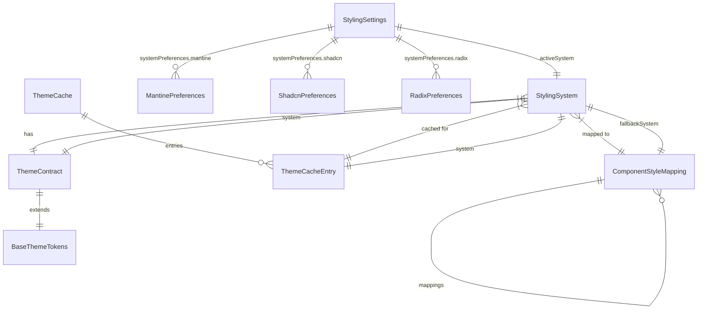

# Data Model: Switchable Styling System Architecture

**Date**: 2025-11-30
**Feature**: 029-switchable-styling-system
**Scope**: Runtime switchable styling with Mantine integration

## Core Entities

### 1. StylingSystem

```typescript
enum StylingSystem {
  MANTINE = 'mantine',
  SHADCN = 'shadcn',
  RADIX = 'radix'
}

interface StylingSystemConfig {
  system: StylingSystem;
  isActive: boolean;
  loadState: 'idle' | 'loading' | 'loaded' | 'error';
  lastError?: string;
}
```

**Description**: Represents the three available styling systems with their runtime state.

**Validation Rules**:
- `system` must be one of the three supported values
- `isActive` can only be true for one system at a time
- `loadState` transitions follow: idle → loading → loaded/error

**State Transitions**:
```
idle → loading → loaded
idle → loading → error → idle
```

### 2. ThemeContract

```typescript
interface ThemeContract {
  id: string;
  system: StylingSystem;
  version: string;
  createdAt: Date;
  updatedAt: Date;
  isLoaded: boolean;
  loadTime?: number; // milliseconds
}

interface BaseThemeTokens {
  colors: {
    primary: string;
    secondary: string;
    background: string;
    foreground: string;
    muted: string;
    accent: string;
    destructive: string;
    border: string;
    input: string;
    ring: string;
  };
  spacing: {
    xs: string;
    sm: string;
    md: string;
    lg: string;
    xl: string;
  };
  radii: {
    sm: string;
    md: string;
    lg: string;
    full: string;
  };
  fonts: {
    body: string;
    heading: string;
    mono: string;
  };
  shadows: {
    sm: string;
    md: string;
    lg: string;
  };
  zIndices: {
    dropdown: string;
    sticky: string;
    modal: string;
    popover: string;
    tooltip: string;
  };
}
```

**Description**: Type-safe theme contracts for each styling system with shared base tokens.

**Validation Rules**:
- `id` must be unique across all theme contracts
- `version` follows semantic versioning
- All color values must be valid CSS color strings
- All spacing values must be valid CSS length units

### 3. StylingSettings

```typescript
interface StylingSettings {
  // Core preferences
  activeSystem: StylingSystem;
  darkMode: boolean;
  autoDarkMode: boolean;

  // Global color preference (maps across systems)
  colorPreference: {
    type: 'semantic' | 'hue' | 'name' | 'hex';
    value: string | number;
    autoMap: boolean;
    lastUpdated: Date;
  };

  // System-specific preferences (overrides only)
  systemPreferences: {
    mantine: Partial<MantinePreferences> & { hasOverride: boolean };
    shadcn: Partial<ShadcnPreferences> & { hasOverride: boolean };
    radix: Partial<RadixPreferences> & { hasOverride: boolean };
  };

  // Performance settings
  enableSystemPreloading: boolean;
  cacheThemeContracts: boolean;

  // Accessibility
  respectSystemPreference: boolean;
  reducedMotion: boolean;
  highContrast: boolean;
}

interface MantinePreferences {
  primaryColor: string;
  defaultRadius: number;
  fontFamily: string;
  headingFontWeight: string;
}

interface ShadcnPreferences {
  primaryHue: number;
  accentHue: number;
  borderRadius: number;
  fontSize: 'xs' | 'sm' | 'base' | 'lg' | 'xl';
}

interface RadixPreferences {
  grayScale: 'slate' | 'gray' | 'zinc' | 'neutral' | 'stone';
  accentColor: string;
  radius: number;
}
```

**Description**: User preferences for styling system behavior and appearance with color synchronization.

**Validation Rules**:
- `activeSystem` must match one of the available systems
- `colorPreference.type` must be valid color type
- `colorPreference.value` must match type constraints
- `systemPreferences.hasOverride` indicates manual override from auto-mapping

### 4. ColorMapper

```typescript
interface ColorMapping {
  semantic: string;      // 'red', 'blue', 'green', etc.
  mantine: string;        // Mantine color name
  shadcn: number;         // HSL hue value (0-360)
  radix: string;          // Radix accent color
  hex: string;           // Hex value for reference
  rgb: string;           // RGB value for reference
  category: 'primary' | 'secondary' | 'accent' | 'neutral' | 'semantic';
}

interface ColorMapper {
  mappings: Map<string, ColorMapping>;
  mapToSystem: (color: string | number, targetSystem: StylingSystem) => ColorMapping | null;
  mapFromSystem: (systemColor: string | number, sourceSystem: StylingSystem) => ColorMapping | null;
  validateColor: (color: string | number, type: string) => boolean;
}
```

**Description**: Handles bidirectional color mapping between styling systems.

**Validation Rules**:
- All mappings must have valid color values for each system
- Hue values must be within 0-360 range
- Mantine color names must be valid Mantine colors
- Radix accent colors must be supported

### 5. ThemeCache

```typescript
interface ThemeCacheEntry {
  system: StylingSystem;
  darkMode: boolean;
  cssVariables: Record<string, string>;
  compiledAt: Date;
  expiresAt: Date;
  size: number; // bytes
  isValid: boolean;
}

interface ThemeCache {
  entries: Map<string, ThemeCacheEntry>;
  maxSize: number; // bytes
  currentSize: number;
  lastCleanup: Date;
}
```

**Description**: Caching layer for compiled theme CSS variables to optimize switching performance.

**Validation Rules**:
- `expiresAt` must be in the future for valid entries
- `currentSize` cannot exceed `maxSize`
- CSS variable keys must be valid CSS custom property names

### 5. ComponentStyleMapping

```typescript
interface ComponentStyleMapping {
  componentId: string;
  mappings: {
    [system in StylingSystem]: {
      recipe?: string; // Vanilla Extract recipe name
      className?: string; // CSS class name
      styles?: Record<string, string>; // Inline styles
      wrapperProps?: Record<string, any>;
    };
  };
  fallbackSystem: StylingSystem;
  isMigrating: boolean;
}

interface StyleMappingRule {
  pattern: RegExp; // Component name pattern
  system: StylingSystem;
  recipe: string;
  conditions?: {
    props?: Record<string, any>;
    context?: Record<string, any>;
  };
}
```

**Description**: Maps components to their styling implementations across different systems.

**Validation Rules**:
- `componentId` must follow React component naming conventions
- Each system mapping must have at least one styling method
- `fallbackSystem` must be a valid system with complete mapping

## Relationships



## Data Flow Patterns

### 1. Theme Switching Flow

```typescript
// 1. User selects new styling system
const handleSystemChange = async (newSystem: StylingSystem) => {
  // 2. Update settings store
  await settingsStore.update({ activeSystem: newSystem });

  // 3. Check cache or load theme contract
  const themeContract = await getOrLoadThemeContract(newSystem, darkMode);

  // 4. Apply CSS variables
  applyThemeVariables(themeContract.cssVariables);

  // 5. Update component mappings
  updateComponentStyleMappings(newSystem);

  // 6. Cache for future use
  cacheThemeContract(themeContract);
};
```

### 2. Settings Persistence Flow

```typescript
// Settings change → Storage → Cross-tab sync
const persistSettings = async (settings: Partial<StylingSettings>) => {
  // 1. Update in-memory state
  updateLocalSettings(settings);

  // 2. Persist to localStorage (immediate)
  localStorage.setItem('bibgraph-settings', JSON.stringify(settings));

  // 3. Backup to IndexedDB (async)
  await indexedDBBackup(settings);

  // 4. Broadcast to other tabs
  broadcastChannel.postMessage({ type: 'SETTINGS_UPDATE', payload: settings });
};
```

### 3. Component Rendering Flow

```typescript
// Component → Style Mapping → CSS Classes
const renderComponent = (Component: React.ComponentType, props: any) => {
  const { activeSystem } = useStylingSettings();
  const mapping = getComponentStyleMapping(Component.name, activeSystem);

  return (
    <Component
      {...props}
      className={`${props.className || ''} ${mapping.className}`}
      data-styling-system={activeSystem}
    />
  );
};
```

## Storage Schema

### localStorage Structure

```typescript
interface LocalStorageData {
  'bibgraph-settings': StylingSettings;
  'styling-system-cache': {
    version: string;
    entries: Array<{
      key: string;
      value: Omit<ThemeCacheEntry, 'expiresAt'>;
      expiresAt: string; // ISO string for serialization
    }>;
  };
}
```

### IndexedDB Structure

```typescript
// Database: BibGraphStyling
// Object Store: settings
interface SettingsRecord {
  key: string;
  value: StylingSettings;
  timestamp: number;
}

// Object Store: themeCache
interface ThemeCacheRecord {
  key: string; // `${system}-${darkMode}`
  value: ThemeCacheEntry;
  timestamp: number;
}
```

## Performance Considerations

### 1. Bundle Splitting

```typescript
// Dynamic imports for theme contracts
const loadThemeContract = async (system: StylingSystem) => {
  switch (system) {
    case StylingSystem.MANTINE:
      return await import('./themes/mantine-theme');
    case StylingSystem.SHADCN:
      return await import('./themes/shadcn-theme');
    case StylingSystem.RADIX:
      return await import('./themes/radix-theme');
  }
};
```

### 2. CSS Variable Optimization

```typescript
// Batch DOM updates for performance
const applyThemeVariables = (variables: Record<string, string>) => {
  const root = document.documentElement;

  // Use requestAnimationFrame for smooth updates
  requestAnimationFrame(() => {
    Object.entries(variables).forEach(([key, value]) => {
      root.style.setProperty(`--${key}`, value);
    });
  });
};
```

### 3. Cache Strategy

```typescript
// LRU cache with expiration
class ThemeCacheManager {
  private cache = new Map<string, ThemeCacheEntry>();
  private maxSize = 5; // Maximum cached themes

  set(key: string, entry: ThemeCacheEntry) {
    if (this.cache.size >= this.maxSize) {
      const firstKey = this.cache.keys().next().value;
      this.cache.delete(firstKey);
    }

    this.cache.set(key, entry);
  }
}
```

## Type Safety Contracts

### Theme Contract Type Guards

```typescript
function isBaseThemeTokens(obj: any): obj is BaseThemeTokens {
  return obj &&
    typeof obj.colors === 'object' &&
    typeof obj.colors.primary === 'string' &&
    typeof obj.spacing === 'object' &&
    typeof obj.spacing.xs === 'string';
}

function isStylingSystem(value: any): value is StylingSystem {
  return Object.values(StylingSystem).includes(value);
}
```

### Settings Validation

```typescript
const validateStylingSettings = (settings: any): settings is StylingSettings => {
  return settings &&
    isStylingSystem(settings.activeSystem) &&
    typeof settings.darkMode === 'boolean' &&
    typeof settings.autoDarkMode === 'boolean' &&
    typeof settings.systemPreferences === 'object';
};
```

This data model provides the foundation for implementing a robust, type-safe switchable styling system that maintains performance while supporting multiple styling approaches and ensuring data integrity across user sessions.